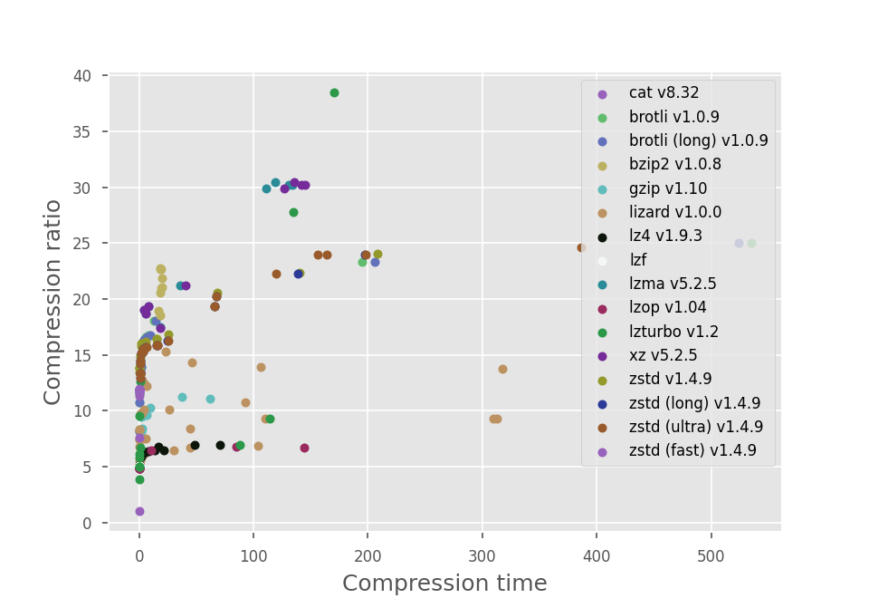

# Ultimate compression benchmark results

## Benchmarked tools

* cat v8.32
* brotli v1.0.9
* bzip2 v1.0.8
* gzip v1.10
* lizard v1.0.0
* lz4 v1.9.3
* lzf
* lzma v5.2.5
* lzop v1.04
* lzturbo v1.2
* xz v5.2.5
* zstd v1.4.9
* zstd (long) v1.4.9
* zstd (ultra) v1.4.9
* zstd (fast) v1.4.9

## Datasets

* examples/database.sql
* examples/database.csv
* examples/random.hex

## Results for `examples/database.sql`

### Table

| Tool | Compression level | Compressed size (kB) | Compression time (s) | Decompression time (s) |
| --- | --- | --- | --- | --- |
| cat v8.32 | 0 | 2898.52 | 0.01 | 0.01 |
| brotli v1.0.9 | 1 | 899.15 | 0.07 | 0.07 |
| brotli v1.0.9 | 2 | 861.71 | 0.17 | 0.07 |
| brotli v1.0.9 | 3 | 895.66 | 0.17 | 0.07 |
| brotli v1.0.9 | 4 | 923.87 | 0.27 | 0.07 |
| brotli v1.0.9 | 5 | 813.44 | 0.52 | 0.07 |
| brotli v1.0.9 | 6 | 795.47 | 0.67 | 0.07 |
| brotli v1.0.9 | 7 | 779.38 | 0.82 | 0.07 |
| brotli v1.0.9 | 8 | 772.83 | 1.07 | 0.07 |
| brotli v1.0.9 | 9 | 767.92 | 1.42 | 0.04 |
| bzip2 v1.0.8 | 1 | 711.67 | 0.62 | 0.32 |
| bzip2 v1.0.8 | 2 | 709.17 | 0.62 | 0.32 |
| bzip2 v1.0.8 | 3 | 703.14 | 0.62 | 0.32 |
| bzip2 v1.0.8 | 4 | 705.67 | 0.62 | 0.32 |
| bzip2 v1.0.8 | 5 | 708.04 | 0.62 | 0.37 |
| bzip2 v1.0.8 | 6 | 703.92 | 0.67 | 0.37 |
| bzip2 v1.0.8 | 7 | 701.04 | 0.67 | 0.37 |
| bzip2 v1.0.8 | 8 | 698.14 | 0.67 | 0.37 |
| bzip2 v1.0.8 | 9 | 697.65 | 0.67 | 0.37 |
| gzip v1.10 | 1 | 1040.58 | 0.17 | 0.12 |
| gzip v1.10 | 2 | 1003.17 | 0.22 | 0.12 |
| gzip v1.10 | 3 | 966.25 | 0.27 | 0.12 |
| gzip v1.10 | 4 | 914.41 | 0.27 | 0.12 |
| gzip v1.10 | 5 | 843.12 | 0.37 | 0.07 |
| gzip v1.10 | 6 | 822.48 | 0.52 | 0.07 |
| gzip v1.10 | 7 | 818.01 | 0.62 | 0.07 |
| gzip v1.10 | 8 | 811.83 | 1.22 | 0.07 |
| gzip v1.10 | 9 | 810.72 | 1.52 | 0.07 |
| lizard v1.0.0 | 10 | 1476.17 | 0.07 | 0.02 |
| lizard v1.0.0 | 11 | 1433.94 | 0.07 | 0.02 |
| lizard v1.0.0 | 12 | 1249.58 | 0.12 | 0.02 |
| lizard v1.0.0 | 13 | 1201.37 | 0.17 | 0.02 |
| lizard v1.0.0 | 14 | 1163.93 | 0.22 | 0.02 |
| lizard v1.0.0 | 15 | 1138.03 | 0.22 | 0.02 |
| lizard v1.0.0 | 16 | 1098.65 | 0.37 | 0.02 |
| lizard v1.0.0 | 17 | 1065.86 | 0.87 | 0.02 |
| lizard v1.0.0 | 18 | 1054.01 | 1.77 | 0.02 |
| lizard v1.0.0 | 19 | 1050.14 | 1.97 | 0.02 |
| lizard v1.0.0 | 20 | 1445.55 | 0.07 | 0.04 |
| lizard v1.0.0 | 21 | 1261.30 | 0.12 | 0.02 |
| lizard v1.0.0 | 22 | 1203.87 | 0.12 | 0.02 |
| lizard v1.0.0 | 23 | 1173.82 | 0.27 | 0.02 |
| lizard v1.0.0 | 24 | 1110.10 | 0.42 | 0.02 |
| lizard v1.0.0 | 25 | 1049.48 | 0.67 | 0.02 |
| lizard v1.0.0 | 26 | 999.25 | 2.33 | 0.02 |
| lizard v1.0.0 | 27 | 945.50 | 3.43 | 0.02 |
| lizard v1.0.0 | 28 | 944.98 | 3.58 | 0.02 |
| lizard v1.0.0 | 29 | 944.98 | 3.63 | 0.04 |
| lizard v1.0.0 | 30 | 966.53 | 0.07 | 0.04 |
| lizard v1.0.0 | 31 | 966.93 | 0.07 | 0.04 |
| lizard v1.0.0 | 32 | 857.93 | 0.12 | 0.04 |
| lizard v1.0.0 | 33 | 858.76 | 0.12 | 0.04 |
| lizard v1.0.0 | 34 | 839.63 | 0.17 | 0.04 |
| lizard v1.0.0 | 35 | 826.10 | 0.22 | 0.04 |
| lizard v1.0.0 | 36 | 816.11 | 0.22 | 0.04 |
| lizard v1.0.0 | 37 | 829.45 | 0.37 | 0.04 |
| lizard v1.0.0 | 38 | 812.59 | 0.87 | 0.04 |
| lizard v1.0.0 | 39 | 823.99 | 2.03 | 0.04 |
| lizard v1.0.0 | 40 | 1058.42 | 0.07 | 0.04 |
| lizard v1.0.0 | 41 | 920.80 | 0.12 | 0.04 |
| lizard v1.0.0 | 42 | 891.01 | 0.12 | 0.04 |
| lizard v1.0.0 | 43 | 831.00 | 0.32 | 0.04 |
| lizard v1.0.0 | 44 | 795.87 | 0.57 | 0.04 |
| lizard v1.0.0 | 45 | 780.82 | 0.87 | 0.04 |
| lizard v1.0.0 | 46 | 788.59 | 1.53 | 0.04 |
| lizard v1.0.0 | 47 | 793.11 | 2.68 | 0.04 |
| lizard v1.0.0 | 48 | 743.76 | 4.18 | 0.04 |
| lizard v1.0.0 | 49 | 743.71 | 4.29 | 0.04 |
| lz4 v1.9.3 | 1 | 1467.61 | 0.07 | 0.02 |
| lz4 v1.9.3 | 2 | 1467.61 | 0.07 | 0.04 |
| lz4 v1.9.3 | 3 | 1148.18 | 0.22 | 0.02 |
| lz4 v1.9.3 | 4 | 1114.74 | 0.27 | 0.02 |
| lz4 v1.9.3 | 5 | 1091.18 | 0.37 | 0.02 |
| lz4 v1.9.3 | 6 | 1076.35 | 0.47 | 0.02 |
| lz4 v1.9.3 | 7 | 1068.62 | 0.62 | 0.02 |
| lz4 v1.9.3 | 8 | 1065.00 | 0.72 | 0.02 |
| lz4 v1.9.3 | 9 | 1063.55 | 0.92 | 0.02 |
| lz4 v1.9.3 | 10 | 1056.24 | 1.38 | 0.02 |
| lz4 v1.9.3 | 11 | 1049.86 | 2.48 | 0.02 |
| lz4 v1.9.3 | 12 | 1049.16 | 1.63 | 0.02 |
| lzf | 1 | 1395.98 | 0.07 | 0.04 |
| lzf | 2 | 1395.98 | 0.07 | 0.04 |
| lzf | 3 | 1395.98 | 0.07 | 0.04 |
| lzf | 4 | 1395.98 | 0.07 | 0.04 |
| lzf | 5 | 1395.98 | 0.07 | 0.04 |
| lzf | 6 | 1395.98 | 0.07 | 0.04 |
| lzf | 7 | 1395.98 | 0.07 | 0.04 |
| lzf | 8 | 1395.98 | 0.07 | 0.04 |
| lzf | 9 | 1395.98 | 0.07 | 0.04 |
| lzf | 10 | 1395.98 | 0.07 | 0.04 |
| lzf | 11 | 1395.98 | 0.07 | 0.04 |
| lzf | 12 | 1395.98 | 0.07 | 0.04 |
| lzma v5.2.5 | 1 | 738.40 | 0.87 | 0.22 |
| lzma v5.2.5 | 2 | 711.82 | 1.38 | 0.17 |
| lzma v5.2.5 | 3 | 701.70 | 1.98 | 0.22 |
| lzma v5.2.5 | 4 | 527.12 | 4.54 | 0.17 |
| lzma v5.2.5 | 5 | 517.33 | 4.58 | 0.17 |
| lzma v5.2.5 | 6 | 516.27 | 4.79 | 0.17 |
| lzma v5.2.5 | 7 | 516.27 | 4.89 | 0.17 |
| lzma v5.2.5 | 8 | 516.27 | 4.68 | 0.17 |
| lzma v5.2.5 | 9 | 516.27 | 5.44 | 0.17 |
| lzop v1.04 | 1 | 1351.66 | 0.07 | 0.07 |
| lzop v1.04 | 2 | 1348.47 | 0.07 | 0.04 |
| lzop v1.04 | 3 | 1348.47 | 0.07 | 0.07 |
| lzop v1.04 | 4 | 1348.47 | 0.07 | 0.07 |
| lzop v1.04 | 5 | 1348.47 | 0.08 | 0.07 |
| lzop v1.04 | 6 | 1348.47 | 0.07 | 0.04 |
| lzop v1.04 | 7 | 1098.09 | 1.08 | 0.04 |
| lzop v1.04 | 8 | 1084.85 | 3.13 | 0.04 |
| lzop v1.04 | 9 | 1084.59 | 3.33 | 0.04 |
| lzturbo v1.2 | 10 | 1479.43 | 0.07 | 0.04 |
| lzturbo v1.2 | 11 | 1338.26 | 0.12 | 0.04 |
| lzturbo v1.2 | 12 | 1280.30 | 0.17 | 0.02 |
| lzturbo v1.2 | 19 | 1049.50 | 3.38 | 0.02 |
| lzturbo v1.2 | 20 | 1335.80 | 0.07 | 0.04 |
| lzturbo v1.2 | 21 | 1214.54 | 0.12 | 0.04 |
| lzturbo v1.2 | 22 | 1184.39 | 0.27 | 0.04 |
| lzturbo v1.2 | 29 | 953.93 | 4.13 | 0.04 |
| lzturbo v1.2 | 30 | 978.18 | 0.12 | 0.07 |
| lzturbo v1.2 | 31 | 896.49 | 0.12 | 0.07 |
| lzturbo v1.2 | 32 | 816.44 | 0.37 | 0.07 |
| lzturbo v1.2 | 39 | 609.38 | 4.38 | 0.07 |
| lzturbo v1.2 | 49 | 513.43 | 6.04 | 0.22 |
| xz v5.2.5 | 1 | 738.55 | 0.72 | 0.22 |
| xz v5.2.5 | 2 | 711.97 | 1.12 | 0.22 |
| xz v5.2.5 | 3 | 701.84 | 1.57 | 0.17 |
| xz v5.2.5 | 4 | 527.25 | 3.98 | 0.17 |
| xz v5.2.5 | 5 | 517.45 | 4.23 | 0.17 |
| xz v5.2.5 | 6 | 516.39 | 4.53 | 0.17 |
| xz v5.2.5 | 7 | 516.39 | 4.53 | 0.17 |
| xz v5.2.5 | 8 | 516.39 | 4.53 | 0.17 |
| xz v5.2.5 | 9 | 516.39 | 4.53 | 0.17 |
| zstd v1.4.9 | 1 | 820.53 | 0.07 | 0.04 |
| zstd v1.4.9 | 2 | 883.37 | 0.12 | 0.04 |
| zstd v1.4.9 | 3 | 885.21 | 0.12 | 0.04 |
| zstd v1.4.9 | 4 | 889.28 | 0.12 | 0.04 |
| zstd v1.4.9 | 5 | 901.42 | 0.17 | 0.04 |
| zstd v1.4.9 | 6 | 890.73 | 0.17 | 0.04 |
| zstd v1.4.9 | 7 | 830.22 | 0.27 | 0.04 |
| zstd v1.4.9 | 8 | 773.95 | 0.32 | 0.04 |
| zstd v1.4.9 | 9 | 766.43 | 0.42 | 0.04 |
| zstd v1.4.9 | 10 | 760.19 | 0.47 | 0.04 |
| zstd v1.4.9 | 11 | 756.58 | 0.57 | 0.04 |
| zstd v1.4.9 | 12 | 751.28 | 0.82 | 0.04 |
| zstd v1.4.9 | 13 | 736.87 | 1.22 | 0.04 |
| zstd v1.4.9 | 14 | 733.29 | 1.32 | 0.04 |
| zstd v1.4.9 | 15 | 723.65 | 1.57 | 0.04 |
| zstd v1.4.9 | 16 | 631.95 | 2.88 | 0.04 |
| zstd v1.4.9 | 17 | 631.71 | 3.23 | 0.04 |
| zstd v1.4.9 | 18 | 633.19 | 4.13 | 0.04 |
| zstd v1.4.9 | 19 | 632.88 | 4.28 | 0.04 |
| zstd (long) v1.4.9 | 1 | 817.92 | 0.12 | 0.04 |
| zstd (long) v1.4.9 | 2 | 879.70 | 0.12 | 0.04 |
| zstd (long) v1.4.9 | 3 | 885.21 | 0.12 | 0.04 |
| zstd (long) v1.4.9 | 4 | 895.59 | 0.12 | 0.04 |
| zstd (long) v1.4.9 | 5 | 908.33 | 0.17 | 0.04 |
| zstd (long) v1.4.9 | 6 | 888.23 | 0.17 | 0.04 |
| zstd (long) v1.4.9 | 7 | 828.48 | 0.27 | 0.04 |
| zstd (long) v1.4.9 | 8 | 772.64 | 0.32 | 0.04 |
| zstd (long) v1.4.9 | 9 | 765.39 | 0.42 | 0.04 |
| zstd (long) v1.4.9 | 10 | 759.70 | 0.52 | 0.04 |
| zstd (long) v1.4.9 | 11 | 756.09 | 0.57 | 0.04 |
| zstd (long) v1.4.9 | 12 | 751.03 | 0.87 | 0.04 |
| zstd (long) v1.4.9 | 13 | 736.79 | 1.22 | 0.04 |
| zstd (long) v1.4.9 | 14 | 733.27 | 1.32 | 0.04 |
| zstd (long) v1.4.9 | 15 | 723.66 | 1.62 | 0.04 |
| zstd (long) v1.4.9 | 16 | 631.93 | 2.93 | 0.04 |
| zstd (long) v1.4.9 | 17 | 631.63 | 3.28 | 0.04 |
| zstd (long) v1.4.9 | 18 | 633.22 | 4.18 | 0.04 |
| zstd (long) v1.4.9 | 19 | 632.90 | 4.33 | 0.04 |
| zstd (ultra) v1.4.9 | 1 | 817.92 | 0.12 | 0.04 |
| zstd (ultra) v1.4.9 | 2 | 879.70 | 0.12 | 0.04 |
| zstd (ultra) v1.4.9 | 3 | 885.21 | 0.12 | 0.04 |
| zstd (ultra) v1.4.9 | 4 | 895.59 | 0.12 | 0.04 |
| zstd (ultra) v1.4.9 | 5 | 908.33 | 0.17 | 0.04 |
| zstd (ultra) v1.4.9 | 6 | 888.23 | 0.17 | 0.04 |
| zstd (ultra) v1.4.9 | 7 | 828.48 | 0.27 | 0.04 |
| zstd (ultra) v1.4.9 | 8 | 772.64 | 0.32 | 0.04 |
| zstd (ultra) v1.4.9 | 9 | 765.39 | 0.42 | 0.04 |
| zstd (ultra) v1.4.9 | 10 | 759.70 | 0.52 | 0.04 |
| zstd (ultra) v1.4.9 | 11 | 756.09 | 0.57 | 0.04 |
| zstd (ultra) v1.4.9 | 12 | 751.03 | 0.82 | 0.04 |
| zstd (ultra) v1.4.9 | 13 | 736.79 | 1.22 | 0.04 |
| zstd (ultra) v1.4.9 | 14 | 733.27 | 1.32 | 0.04 |
| zstd (ultra) v1.4.9 | 15 | 723.66 | 1.62 | 0.04 |
| zstd (ultra) v1.4.9 | 16 | 631.93 | 2.93 | 0.04 |
| zstd (ultra) v1.4.9 | 17 | 631.63 | 3.28 | 0.04 |
| zstd (ultra) v1.4.9 | 18 | 633.22 | 4.18 | 0.04 |
| zstd (ultra) v1.4.9 | 19 | 632.90 | 4.33 | 0.04 |
| zstd (ultra) v1.4.9 | 20 | 632.90 | 4.43 | 0.04 |
| zstd (ultra) v1.4.9 | 21 | 632.87 | 4.64 | 0.04 |
| zstd (ultra) v1.4.9 | 22 | 632.78 | 5.09 | 0.04 |
| zstd (fast) v1.4.9 | 1 | 1178.75 | 0.07 | 0.04 |
| zstd (fast) v1.4.9 | 2 | 1160.47 | 0.07 | 0.04 |
| zstd (fast) v1.4.9 | 3 | 1178.11 | 0.07 | 0.02 |
| zstd (fast) v1.4.9 | 4 | 1178.61 | 0.07 | 0.02 |
| zstd (fast) v1.4.9 | 5 | 1232.19 | 0.07 | 0.02 |
| zstd (fast) v1.4.9 | 6 | 1354.06 | 0.07 | 0.02 |
| zstd (fast) v1.4.9 | 7 | 1460.85 | 0.07 | 0.02 |
| zstd (fast) v1.4.9 | 8 | 1564.78 | 0.07 | 0.02 |
| zstd (fast) v1.4.9 | 9 | 1788.29 | 0.07 | 0.02 |
| zstd (fast) v1.4.9 | 10 | 1801.68 | 0.07 | 0.02 |
| zstd (fast) v1.4.9 | 11 | 1955.68 | 0.07 | 0.02 |
| zstd (fast) v1.4.9 | 12 | 2136.36 | 0.07 | 0.02 |
| zstd (fast) v1.4.9 | 13 | 2296.31 | 0.04 | 0.02 |
| zstd (fast) v1.4.9 | 14 | 2469.26 | 0.04 | 0.02 |
| zstd (fast) v1.4.9 | 15 | 2612.64 | 0.04 | 0.02 |
| zstd (fast) v1.4.9 | 16 | 2309.51 | 0.04 | 0.02 |
| zstd (fast) v1.4.9 | 17 | 2167.34 | 0.04 | 0.02 |
| zstd (fast) v1.4.9 | 18 | 2096.79 | 0.04 | 0.02 |
| zstd (fast) v1.4.9 | 19 | 2101.27 | 0.04 | 0.02 |
| zstd (fast) v1.4.9 | 50 | 2557.03 | 0.04 | 0.02 |
| zstd (fast) v1.4.9 | 100 | 2683.69 | 0.04 | 0.02 |
| zstd (fast) v1.4.9 | 1000 | 2898.60 | 0.02 | 0.01 |

### Compression time vs compression ratio

### Compression time vs decompression time

## Results for `examples/database.csv`

### Table

| Tool | Compression level | Compressed size (kB) | Compression time (s) | Decompression time (s) |
| --- | --- | --- | --- | --- |
| cat v8.32 | 0 | 58000.96 | 0.12 | 0.12 |
| brotli v1.0.9 | 1 | 5412.76 | 0.37 | 0.42 |
| brotli v1.0.9 | 2 | 4304.78 | 0.82 | 0.32 |
| brotli v1.0.9 | 3 | 4159.55 | 1.02 | 0.32 |
| brotli v1.0.9 | 4 | 4159.22 | 1.67 | 0.27 |
| brotli v1.0.9 | 5 | 3592.04 | 3.23 | 0.27 |
| brotli v1.0.9 | 6 | 3555.45 | 4.08 | 0.27 |
| brotli v1.0.9 | 7 | 3495.40 | 5.79 | 0.27 |
| brotli v1.0.9 | 8 | 3454.67 | 8.40 | 0.27 |
| brotli v1.0.9 | 9 | 3211.71 | 12.87 | 0.27 |
| bzip2 v1.0.8 | 1 | 3066.56 | 15.72 | 2.48 |
| bzip2 v1.0.8 | 2 | 3123.77 | 16.47 | 2.68 |
| bzip2 v1.0.8 | 3 | 2823.34 | 17.07 | 2.73 |
| bzip2 v1.0.8 | 4 | 2765.26 | 18.47 | 2.83 |
| bzip2 v1.0.8 | 5 | 2756.27 | 18.32 | 2.83 |
| bzip2 v1.0.8 | 6 | 2651.62 | 18.32 | 2.93 |
| bzip2 v1.0.8 | 7 | 2561.63 | 18.62 | 2.93 |
| bzip2 v1.0.8 | 8 | 2547.06 | 18.82 | 3.03 |
| bzip2 v1.0.8 | 9 | 2562.50 | 19.33 | 3.08 |
| gzip v1.10 | 1 | 7143.32 | 1.57 | 0.87 |
| gzip v1.10 | 2 | 7075.17 | 1.67 | 0.82 |
| gzip v1.10 | 3 | 6874.72 | 2.48 | 0.82 |
| gzip v1.10 | 4 | 6127.18 | 2.02 | 0.82 |
| gzip v1.10 | 5 | 6103.85 | 2.88 | 0.82 |
| gzip v1.10 | 6 | 6029.56 | 6.04 | 0.77 |
| gzip v1.10 | 7 | 5660.86 | 8.55 | 0.77 |
| gzip v1.10 | 8 | 5154.23 | 37.58 | 0.72 |
| gzip v1.10 | 9 | 5252.99 | 57.70 | 0.72 |
| lizard v1.0.0 | 10 | 11341.62 | 0.27 | 0.17 |
| lizard v1.0.0 | 11 | 11334.58 | 0.32 | 0.17 |
| lizard v1.0.0 | 12 | 10151.66 | 0.92 | 0.17 |
| lizard v1.0.0 | 13 | 9751.14 | 1.62 | 0.17 |
| lizard v1.0.0 | 14 | 9503.93 | 2.03 | 0.17 |
| lizard v1.0.0 | 15 | 9330.53 | 2.73 | 0.17 |
| lizard v1.0.0 | 16 | 9436.16 | 3.78 | 0.17 |
| lizard v1.0.0 | 17 | 9016.22 | 26.95 | 0.17 |
| lizard v1.0.0 | 18 | 8619.80 | 41.35 | 0.17 |
| lizard v1.0.0 | 19 | 8408.42 | 92.06 | 0.17 |
| lizard v1.0.0 | 20 | 11708.08 | 0.32 | 0.22 |
| lizard v1.0.0 | 21 | 10497.16 | 0.57 | 0.22 |
| lizard v1.0.0 | 22 | 10497.38 | 0.57 | 0.22 |
| lizard v1.0.0 | 23 | 7764.24 | 2.68 | 0.17 |
| lizard v1.0.0 | 24 | 7715.85 | 3.38 | 0.17 |
| lizard v1.0.0 | 25 | 7732.84 | 5.04 | 0.17 |
| lizard v1.0.0 | 26 | 6923.99 | 40.55 | 0.17 |
| lizard v1.0.0 | 27 | 6255.38 | 99.87 | 0.17 |
| lizard v1.0.0 | 28 | 6218.47 | 307.20 | 0.17 |
| lizard v1.0.0 | 29 | 6218.47 | 306.65 | 0.17 |
| lizard v1.0.0 | 30 | 6991.62 | 0.37 | 0.27 |
| lizard v1.0.0 | 31 | 6978.17 | 0.37 | 0.27 |
| lizard v1.0.0 | 32 | 6003.08 | 0.97 | 0.22 |
| lizard v1.0.0 | 33 | 5992.30 | 0.97 | 0.22 |
| lizard v1.0.0 | 34 | 5998.59 | 1.72 | 0.22 |
| lizard v1.0.0 | 35 | 5922.99 | 2.13 | 0.22 |
| lizard v1.0.0 | 36 | 5872.33 | 2.83 | 0.22 |
| lizard v1.0.0 | 37 | 5751.07 | 3.88 | 0.22 |
| lizard v1.0.0 | 38 | 5717.44 | 27.90 | 0.22 |
| lizard v1.0.0 | 39 | 5403.40 | 92.99 | 0.22 |
| lizard v1.0.0 | 40 | 8560.47 | 0.37 | 0.27 |
| lizard v1.0.0 | 41 | 7847.07 | 0.62 | 0.22 |
| lizard v1.0.0 | 42 | 7847.02 | 0.62 | 0.22 |
| lizard v1.0.0 | 43 | 4573.77 | 2.88 | 0.22 |
| lizard v1.0.0 | 44 | 4651.24 | 3.63 | 0.22 |
| lizard v1.0.0 | 45 | 4744.35 | 5.34 | 0.22 |
| lizard v1.0.0 | 46 | 3790.45 | 23.34 | 0.22 |
| lizard v1.0.0 | 47 | 4046.93 | 44.86 | 0.22 |
| lizard v1.0.0 | 48 | 4174.52 | 104.83 | 0.22 |
| lizard v1.0.0 | 49 | 4219.13 | 317.82 | 0.22 |
| lz4 v1.9.3 | 1 | 11322.72 | 0.27 | 0.17 |
| lz4 v1.9.3 | 2 | 11322.72 | 0.27 | 0.17 |
| lz4 v1.9.3 | 3 | 9799.02 | 1.52 | 0.17 |
| lz4 v1.9.3 | 4 | 9636.33 | 2.23 | 0.17 |
| lz4 v1.9.3 | 5 | 9336.13 | 3.33 | 0.17 |
| lz4 v1.9.3 | 6 | 9174.18 | 5.14 | 0.17 |
| lz4 v1.9.3 | 7 | 9085.07 | 8.44 | 0.17 |
| lz4 v1.9.3 | 8 | 9006.70 | 13.71 | 0.17 |
| lz4 v1.9.3 | 9 | 8964.43 | 22.03 | 0.17 |
| lz4 v1.9.3 | 10 | 8557.29 | 16.42 | 0.17 |
| lz4 v1.9.3 | 11 | 8389.61 | 49.87 | 0.17 |
| lz4 v1.9.3 | 12 | 8363.06 | 65.01 | 0.17 |
| lzf | 1 | 11511.74 | 0.32 | 0.22 |
| lzf | 2 | 11511.74 | 0.32 | 0.22 |
| lzf | 3 | 11511.74 | 0.32 | 0.22 |
| lzf | 4 | 11511.74 | 0.32 | 0.22 |
| lzf | 5 | 11511.74 | 0.32 | 0.22 |
| lzf | 6 | 11511.74 | 0.32 | 0.22 |
| lzf | 7 | 11511.74 | 0.32 | 0.22 |
| lzf | 8 | 11511.74 | 0.32 | 0.22 |
| lzf | 9 | 11511.74 | 0.32 | 0.22 |
| lzf | 10 | 11511.74 | 0.32 | 0.22 |
| lzf | 11 | 11511.74 | 0.32 | 0.22 |
| lzf | 12 | 11511.74 | 0.32 | 0.22 |
| lzma v5.2.5 | 1 | 3051.12 | 3.68 | 0.92 |
| lzma v5.2.5 | 2 | 3096.63 | 5.23 | 0.92 |
| lzma v5.2.5 | 3 | 3001.04 | 7.14 | 0.87 |
| lzma v5.2.5 | 4 | 3325.14 | 16.37 | 0.82 |
| lzma v5.2.5 | 5 | 2736.76 | 35.02 | 0.72 |
| lzma v5.2.5 | 6 | 1941.79 | 108.94 | 0.77 |
| lzma v5.2.5 | 7 | 1903.53 | 110.49 | 0.77 |
| lzma v5.2.5 | 8 | 1920.51 | 112.80 | 0.77 |
| lzma v5.2.5 | 9 | 1920.51 | 115.72 | 0.82 |
| lzop v1.04 | 1 | 11936.90 | 0.32 | 0.32 |
| lzop v1.04 | 2 | 11937.13 | 0.32 | 0.32 |
| lzop v1.04 | 3 | 11937.13 | 0.32 | 0.32 |
| lzop v1.04 | 4 | 11937.13 | 0.32 | 0.32 |
| lzop v1.04 | 5 | 11937.13 | 0.32 | 0.32 |
| lzop v1.04 | 6 | 11937.13 | 0.32 | 0.32 |
| lzop v1.04 | 7 | 8967.25 | 9.90 | 0.27 |
| lzop v1.04 | 8 | 8545.14 | 81.33 | 0.22 |
| lzop v1.04 | 9 | 8613.39 | 141.17 | 0.27 |
| lzturbo v1.2 | 10 | 15134.18 | 0.12 | 0.12 |
| lzturbo v1.2 | 11 | 11615.73 | 0.52 | 0.22 |
| lzturbo v1.2 | 12 | 10051.55 | 0.67 | 0.22 |
| lzturbo v1.2 | 19 | 8358.67 | 97.09 | 0.22 |
| lzturbo v1.2 | 20 | 11567.01 | 0.12 | 0.12 |
| lzturbo v1.2 | 21 | 9490.71 | 0.42 | 0.27 |
| lzturbo v1.2 | 22 | 8636.68 | 0.72 | 0.22 |
| lzturbo v1.2 | 29 | 6222.27 | 118.30 | 0.22 |
| lzturbo v1.2 | 30 | 6058.65 | 0.27 | 0.12 |
| lzturbo v1.2 | 31 | 5005.66 | 0.62 | 0.42 |
| lzturbo v1.2 | 32 | 4595.11 | 1.02 | 0.37 |
| lzturbo v1.2 | 39 | 2088.58 | 137.25 | 0.32 |
| lzturbo v1.2 | 49 | 1508.32 | 166.34 | 0.67 |
| xz v5.2.5 | 1 | 3051.66 | 4.03 | 1.12 |
| xz v5.2.5 | 2 | 3097.18 | 5.59 | 1.07 |
| xz v5.2.5 | 3 | 3001.59 | 7.54 | 1.07 |
| xz v5.2.5 | 4 | 3325.72 | 17.38 | 1.02 |
| xz v5.2.5 | 5 | 2737.26 | 37.64 | 0.97 |
| xz v5.2.5 | 6 | 1942.20 | 115.69 | 0.92 |
| xz v5.2.5 | 7 | 1903.93 | 122.02 | 1.08 |
| xz v5.2.5 | 8 | 1920.91 | 124.43 | 0.97 |
| xz v5.2.5 | 9 | 1920.91 | 120.17 | 1.02 |
| zstd v1.4.9 | 1 | 4198.14 | 0.47 | 0.27 |
| zstd v1.4.9 | 2 | 4318.23 | 0.42 | 0.32 |
| zstd v1.4.9 | 3 | 4199.01 | 0.52 | 0.32 |
| zstd v1.4.9 | 4 | 4196.18 | 0.62 | 0.32 |
| zstd v1.4.9 | 5 | 3922.73 | 0.82 | 0.27 |
| zstd v1.4.9 | 6 | 3876.34 | 0.92 | 0.27 |
| zstd v1.4.9 | 7 | 3672.47 | 1.37 | 0.22 |
| zstd v1.4.9 | 8 | 3625.86 | 1.72 | 0.22 |
| zstd v1.4.9 | 9 | 3616.93 | 2.58 | 0.27 |
| zstd v1.4.9 | 10 | 3617.67 | 2.73 | 0.27 |
| zstd v1.4.9 | 11 | 3618.17 | 2.73 | 0.22 |
| zstd v1.4.9 | 12 | 3576.16 | 4.84 | 0.27 |
| zstd v1.4.9 | 13 | 3536.56 | 13.37 | 0.27 |
| zstd v1.4.9 | 14 | 3538.68 | 13.42 | 0.27 |
| zstd v1.4.9 | 15 | 3438.59 | 23.25 | 0.27 |
| zstd v1.4.9 | 16 | 2995.54 | 59.93 | 0.22 |
| zstd v1.4.9 | 17 | 2820.99 | 58.71 | 0.22 |
| zstd v1.4.9 | 18 | 2599.22 | 122.12 | 0.22 |
| zstd v1.4.9 | 19 | 2414.73 | 187.84 | 0.32 |
| zstd (long) v1.4.9 | 1 | 4349.13 | 0.62 | 0.32 |
| zstd (long) v1.4.9 | 2 | 4475.54 | 0.67 | 0.32 |
| zstd (long) v1.4.9 | 3 | 4337.78 | 0.67 | 0.32 |
| zstd (long) v1.4.9 | 4 | 4336.94 | 0.82 | 0.37 |
| zstd (long) v1.4.9 | 5 | 4063.46 | 1.38 | 0.32 |
| zstd (long) v1.4.9 | 6 | 3995.15 | 1.23 | 0.37 |
| zstd (long) v1.4.9 | 7 | 3832.60 | 1.77 | 0.37 |
| zstd (long) v1.4.9 | 8 | 3801.00 | 2.63 | 0.38 |
| zstd (long) v1.4.9 | 9 | 3798.91 | 3.49 | 0.32 |
| zstd (long) v1.4.9 | 10 | 3751.07 | 3.18 | 0.27 |
| zstd (long) v1.4.9 | 11 | 3741.73 | 2.78 | 0.27 |
| zstd (long) v1.4.9 | 12 | 3702.56 | 4.63 | 0.27 |
| zstd (long) v1.4.9 | 13 | 3661.70 | 12.11 | 0.27 |
| zstd (long) v1.4.9 | 14 | 3659.48 | 12.31 | 0.27 |
| zstd (long) v1.4.9 | 15 | 3560.37 | 22.09 | 0.33 |
| zstd (long) v1.4.9 | 16 | 3001.61 | 53.80 | 0.27 |
| zstd (long) v1.4.9 | 17 | 2868.03 | 57.82 | 0.32 |
| zstd (long) v1.4.9 | 18 | 2605.01 | 126.31 | 0.48 |
| zstd (long) v1.4.9 | 19 | 2418.55 | 186.72 | 0.27 |
| zstd (ultra) v1.4.9 | 1 | 4349.13 | 0.77 | 0.37 |
| zstd (ultra) v1.4.9 | 2 | 4475.54 | 0.72 | 0.37 |
| zstd (ultra) v1.4.9 | 3 | 4337.78 | 1.02 | 0.42 |
| zstd (ultra) v1.4.9 | 4 | 4336.94 | 0.92 | 0.42 |
| zstd (ultra) v1.4.9 | 5 | 4063.46 | 1.22 | 0.32 |
| zstd (ultra) v1.4.9 | 6 | 3995.15 | 1.22 | 0.32 |
| zstd (ultra) v1.4.9 | 7 | 3832.60 | 1.63 | 0.32 |
| zstd (ultra) v1.4.9 | 8 | 3801.00 | 1.97 | 0.27 |
| zstd (ultra) v1.4.9 | 9 | 3798.91 | 3.53 | 0.32 |
| zstd (ultra) v1.4.9 | 10 | 3751.07 | 2.83 | 0.27 |
| zstd (ultra) v1.4.9 | 11 | 3741.73 | 2.88 | 0.27 |
| zstd (ultra) v1.4.9 | 12 | 3702.56 | 5.64 | 0.27 |
| zstd (ultra) v1.4.9 | 13 | 3661.70 | 13.31 | 0.27 |
| zstd (ultra) v1.4.9 | 14 | 3659.48 | 13.61 | 0.27 |
| zstd (ultra) v1.4.9 | 15 | 3560.37 | 20.24 | 0.27 |
| zstd (ultra) v1.4.9 | 16 | 3001.61 | 53.75 | 0.37 |
| zstd (ultra) v1.4.9 | 17 | 2868.03 | 60.66 | 0.53 |
| zstd (ultra) v1.4.9 | 18 | 2605.01 | 120.91 | 0.32 |
| zstd (ultra) v1.4.9 | 19 | 2418.55 | 174.21 | 0.27 |
| zstd (ultra) v1.4.9 | 20 | 2416.39 | 170.18 | 0.27 |
| zstd (ultra) v1.4.9 | 21 | 2415.97 | 171.97 | 0.27 |
| zstd (ultra) v1.4.9 | 22 | 2352.79 | 309.66 | 0.27 |
| zstd (fast) v1.4.9 | 1 | 4860.86 | 0.42 | 0.27 |
| zstd (fast) v1.4.9 | 2 | 4862.91 | 0.42 | 0.27 |
| zstd (fast) v1.4.9 | 3 | 4862.89 | 0.42 | 0.27 |
| zstd (fast) v1.4.9 | 4 | 4869.07 | 0.42 | 0.27 |
| zstd (fast) v1.4.9 | 5 | 4868.36 | 0.42 | 0.27 |
| zstd (fast) v1.4.9 | 6 | 4872.27 | 0.42 | 0.27 |
| zstd (fast) v1.4.9 | 7 | 4876.46 | 0.42 | 0.27 |
| zstd (fast) v1.4.9 | 8 | 4883.09 | 0.42 | 0.27 |
| zstd (fast) v1.4.9 | 9 | 4884.51 | 0.42 | 0.27 |
| zstd (fast) v1.4.9 | 10 | 4890.17 | 0.42 | 0.27 |
| zstd (fast) v1.4.9 | 11 | 4889.86 | 0.42 | 0.27 |
| zstd (fast) v1.4.9 | 12 | 4893.42 | 0.42 | 0.27 |
| zstd (fast) v1.4.9 | 13 | 4893.60 | 0.42 | 0.27 |
| zstd (fast) v1.4.9 | 14 | 4902.76 | 0.42 | 0.27 |
| zstd (fast) v1.4.9 | 15 | 4902.02 | 0.42 | 0.27 |
| zstd (fast) v1.4.9 | 16 | 4900.36 | 0.42 | 0.27 |
| zstd (fast) v1.4.9 | 17 | 4900.17 | 0.42 | 0.27 |
| zstd (fast) v1.4.9 | 18 | 4903.91 | 0.42 | 0.27 |
| zstd (fast) v1.4.9 | 19 | 4903.49 | 0.47 | 0.27 |
| zstd (fast) v1.4.9 | 50 | 5006.37 | 0.47 | 0.27 |
| zstd (fast) v1.4.9 | 100 | 5133.82 | 0.42 | 0.27 |
| zstd (fast) v1.4.9 | 1000 | 7668.57 | 0.42 | 0.27 |

### Compression time vs compression ratio

### Compression time vs decompression time

## Results for `examples/random.hex`

### Table

| Tool | Compression level | Compressed size (kB) | Compression time (s) | Decompression time (s) |
| --- | --- | --- | --- | --- |
| cat v8.32 | 0 | 1024.00 | 0.01 | 0.01 |
| brotli v1.0.9 | 1 | 1024.01 | 0.01 | 0.01 |
| brotli v1.0.9 | 2 | 1024.00 | 0.02 | 0.01 |
| brotli v1.0.9 | 3 | 1024.00 | 0.02 | 0.01 |
| brotli v1.0.9 | 4 | 1024.00 | 0.02 | 0.01 |
| brotli v1.0.9 | 5 | 1024.00 | 0.04 | 0.01 |
| brotli v1.0.9 | 6 | 1024.00 | 0.04 | 0.01 |
| brotli v1.0.9 | 7 | 1024.00 | 0.07 | 0.01 |
| brotli v1.0.9 | 8 | 1024.00 | 0.07 | 0.01 |
| brotli v1.0.9 | 9 | 1024.00 | 0.12 | 0.01 |
| bzip2 v1.0.8 | 1 | 1032.42 | 0.52 | 0.22 |
| bzip2 v1.0.8 | 2 | 1030.87 | 0.52 | 0.22 |
| bzip2 v1.0.8 | 3 | 1030.25 | 0.52 | 0.22 |
| bzip2 v1.0.8 | 4 | 1029.81 | 0.52 | 0.22 |
| bzip2 v1.0.8 | 5 | 1029.74 | 0.52 | 0.22 |
| bzip2 v1.0.8 | 6 | 1029.35 | 0.52 | 0.22 |
| bzip2 v1.0.8 | 7 | 1029.38 | 0.52 | 0.22 |
| bzip2 v1.0.8 | 8 | 1029.45 | 0.52 | 0.22 |
| bzip2 v1.0.8 | 9 | 1028.71 | 0.52 | 0.22 |
| gzip v1.10 | 1 | 1024.17 | 0.12 | 0.04 |
| gzip v1.10 | 2 | 1024.17 | 0.12 | 0.04 |
| gzip v1.10 | 3 | 1024.17 | 0.12 | 0.04 |
| gzip v1.10 | 4 | 1024.17 | 0.12 | 0.04 |
| gzip v1.10 | 5 | 1024.17 | 0.12 | 0.04 |
| gzip v1.10 | 6 | 1024.17 | 0.12 | 0.04 |
| gzip v1.10 | 7 | 1024.17 | 0.12 | 0.04 |
| gzip v1.10 | 8 | 1024.17 | 0.12 | 0.04 |
| gzip v1.10 | 9 | 1024.17 | 0.12 | 0.04 |
| lizard v1.0.0 | 10 | 1024.02 | 0.01 | 0.01 |
| lizard v1.0.0 | 11 | 1024.02 | 0.02 | 0.01 |
| lizard v1.0.0 | 12 | 1024.02 | 0.07 | 0.01 |
| lizard v1.0.0 | 13 | 1024.02 | 0.12 | 0.01 |
| lizard v1.0.0 | 14 | 1024.02 | 0.12 | 0.01 |
| lizard v1.0.0 | 15 | 1024.02 | 0.12 | 0.01 |
| lizard v1.0.0 | 16 | 1024.02 | 0.12 | 0.01 |
| lizard v1.0.0 | 17 | 1024.02 | 0.12 | 0.01 |
| lizard v1.0.0 | 18 | 1024.02 | 0.12 | 0.01 |
| lizard v1.0.0 | 19 | 1024.02 | 0.22 | 0.01 |
| lizard v1.0.0 | 20 | 1024.02 | 0.01 | 0.01 |
| lizard v1.0.0 | 21 | 1024.02 | 0.07 | 0.01 |
| lizard v1.0.0 | 22 | 1024.02 | 0.07 | 0.01 |
| lizard v1.0.0 | 23 | 1024.02 | 0.17 | 0.01 |
| lizard v1.0.0 | 24 | 1024.02 | 0.27 | 0.01 |
| lizard v1.0.0 | 25 | 1024.02 | 0.27 | 0.01 |
| lizard v1.0.0 | 26 | 1024.02 | 0.27 | 0.01 |
| lizard v1.0.0 | 27 | 1024.02 | 0.27 | 0.01 |
| lizard v1.0.0 | 28 | 1024.02 | 0.27 | 0.01 |
| lizard v1.0.0 | 29 | 1024.02 | 0.27 | 0.01 |
| lizard v1.0.0 | 30 | 1024.02 | 0.01 | 0.01 |
| lizard v1.0.0 | 31 | 1024.02 | 0.01 | 0.01 |
| lizard v1.0.0 | 32 | 1024.02 | 0.04 | 0.01 |
| lizard v1.0.0 | 33 | 1024.02 | 0.07 | 0.01 |
| lizard v1.0.0 | 34 | 1024.02 | 0.12 | 0.01 |
| lizard v1.0.0 | 35 | 1024.02 | 0.12 | 0.01 |
| lizard v1.0.0 | 36 | 1024.02 | 0.12 | 0.01 |
| lizard v1.0.0 | 37 | 1024.02 | 0.12 | 0.01 |
| lizard v1.0.0 | 38 | 1024.02 | 0.12 | 0.01 |
| lizard v1.0.0 | 39 | 1024.02 | 0.22 | 0.01 |
| lizard v1.0.0 | 40 | 1024.02 | 0.01 | 0.01 |
| lizard v1.0.0 | 41 | 1024.02 | 0.07 | 0.01 |
| lizard v1.0.0 | 42 | 1024.02 | 0.07 | 0.01 |
| lizard v1.0.0 | 43 | 1024.02 | 0.17 | 0.01 |
| lizard v1.0.0 | 44 | 1024.02 | 0.27 | 0.01 |
| lizard v1.0.0 | 45 | 1024.02 | 0.27 | 0.01 |
| lizard v1.0.0 | 46 | 1024.02 | 0.32 | 0.01 |
| lizard v1.0.0 | 47 | 1024.02 | 0.27 | 0.01 |
| lizard v1.0.0 | 48 | 1024.02 | 0.27 | 0.01 |
| lizard v1.0.0 | 49 | 1024.02 | 0.27 | 0.01 |
| lz4 v1.9.3 | 1 | 1024.02 | 0.01 | 0.01 |
| lz4 v1.9.3 | 2 | 1024.02 | 0.01 | 0.01 |
| lz4 v1.9.3 | 3 | 1024.02 | 0.12 | 0.01 |
| lz4 v1.9.3 | 4 | 1024.02 | 0.12 | 0.01 |
| lz4 v1.9.3 | 5 | 1024.02 | 0.12 | 0.01 |
| lz4 v1.9.3 | 6 | 1024.02 | 0.17 | 0.01 |
| lz4 v1.9.3 | 7 | 1024.02 | 0.12 | 0.01 |
| lz4 v1.9.3 | 8 | 1024.02 | 0.17 | 0.01 |
| lz4 v1.9.3 | 9 | 1024.02 | 0.17 | 0.01 |
| lz4 v1.9.3 | 10 | 1024.02 | 0.17 | 0.01 |
| lz4 v1.9.3 | 11 | 1024.02 | 0.17 | 0.01 |
| lz4 v1.9.3 | 12 | 1024.02 | 0.17 | 0.01 |
| lzf | 1 | 1024.08 | 0.04 | 0.01 |
| lzf | 2 | 1024.08 | 0.04 | 0.01 |
| lzf | 3 | 1024.08 | 0.04 | 0.01 |
| lzf | 4 | 1024.08 | 0.04 | 0.01 |
| lzf | 5 | 1024.08 | 0.04 | 0.01 |
| lzf | 6 | 1024.08 | 0.04 | 0.01 |
| lzf | 7 | 1024.08 | 0.04 | 0.01 |
| lzf | 8 | 1024.08 | 0.04 | 0.01 |
| lzf | 9 | 1024.08 | 0.04 | 0.01 |
| lzf | 10 | 1024.08 | 0.04 | 0.01 |
| lzf | 11 | 1024.08 | 0.04 | 0.01 |
| lzf | 12 | 1024.08 | 0.04 | 0.01 |
| lzma v5.2.5 | 1 | 1038.78 | 0.72 | 0.27 |
| lzma v5.2.5 | 2 | 1038.78 | 0.62 | 0.27 |
| lzma v5.2.5 | 3 | 1038.78 | 0.62 | 0.27 |
| lzma v5.2.5 | 4 | 1037.96 | 0.67 | 0.27 |
| lzma v5.2.5 | 5 | 1037.96 | 0.67 | 0.27 |
| lzma v5.2.5 | 6 | 1037.96 | 0.67 | 0.27 |
| lzma v5.2.5 | 7 | 1037.96 | 0.77 | 0.27 |
| lzma v5.2.5 | 8 | 1037.96 | 0.82 | 0.27 |
| lzma v5.2.5 | 9 | 1037.96 | 0.77 | 0.27 |
| lzop v1.04 | 1 | 1024.09 | 0.01 | 0.01 |
| lzop v1.04 | 2 | 1024.09 | 0.01 | 0.01 |
| lzop v1.04 | 3 | 1024.09 | 0.01 | 0.01 |
| lzop v1.04 | 4 | 1024.09 | 0.01 | 0.01 |
| lzop v1.04 | 5 | 1024.09 | 0.01 | 0.01 |
| lzop v1.04 | 6 | 1024.09 | 0.01 | 0.01 |
| lzop v1.04 | 7 | 1024.09 | 0.22 | 0.01 |
| lzop v1.04 | 8 | 1024.09 | 0.37 | 0.01 |
| lzop v1.04 | 9 | 1024.09 | 0.37 | 0.01 |
| lzturbo v1.2 | 10 | 1024.03 | 0.02 | 0.01 |
| lzturbo v1.2 | 11 | 1024.03 | 0.02 | 0.01 |
| lzturbo v1.2 | 12 | 1024.03 | 0.07 | 0.01 |
| lzturbo v1.2 | 19 | 1024.03 | 0.52 | 0.01 |
| lzturbo v1.2 | 20 | 1024.03 | 0.01 | 0.01 |
| lzturbo v1.2 | 21 | 1024.03 | 0.02 | 0.01 |
| lzturbo v1.2 | 22 | 1024.03 | 0.17 | 0.01 |
| lzturbo v1.2 | 29 | 1024.03 | 0.52 | 0.01 |
| lzturbo v1.2 | 30 | 1024.03 | 0.02 | 0.01 |
| lzturbo v1.2 | 31 | 1024.03 | 0.02 | 0.01 |
| lzturbo v1.2 | 32 | 1024.03 | 0.27 | 0.01 |
| lzturbo v1.2 | 39 | 1024.03 | 0.62 | 0.01 |
| lzturbo v1.2 | 49 | 1024.03 | 1.07 | 0.01 |
| xz v5.2.5 | 1 | 1024.11 | 0.72 | 0.02 |
| xz v5.2.5 | 2 | 1024.11 | 0.67 | 0.02 |
| xz v5.2.5 | 3 | 1024.11 | 0.67 | 0.02 |
| xz v5.2.5 | 4 | 1024.11 | 0.72 | 0.02 |
| xz v5.2.5 | 5 | 1024.11 | 0.72 | 0.02 |
| xz v5.2.5 | 6 | 1024.11 | 0.77 | 0.02 |
| xz v5.2.5 | 7 | 1024.11 | 0.77 | 0.02 |
| xz v5.2.5 | 8 | 1024.11 | 0.82 | 0.02 |
| xz v5.2.5 | 9 | 1024.11 | 0.77 | 0.01 |
| zstd v1.4.9 | 1 | 1024.03 | 0.02 | 0.01 |
| zstd v1.4.9 | 2 | 1024.03 | 0.02 | 0.01 |
| zstd v1.4.9 | 3 | 1024.03 | 0.02 | 0.01 |
| zstd v1.4.9 | 4 | 1024.03 | 0.02 | 0.01 |
| zstd v1.4.9 | 5 | 1024.03 | 0.04 | 0.01 |
| zstd v1.4.9 | 6 | 1024.03 | 0.04 | 0.01 |
| zstd v1.4.9 | 7 | 1024.03 | 0.04 | 0.01 |
| zstd v1.4.9 | 8 | 1024.03 | 0.04 | 0.01 |
| zstd v1.4.9 | 9 | 1024.03 | 0.07 | 0.01 |
| zstd v1.4.9 | 10 | 1024.03 | 0.07 | 0.01 |
| zstd v1.4.9 | 11 | 1024.03 | 0.12 | 0.01 |
| zstd v1.4.9 | 12 | 1024.03 | 0.12 | 0.01 |
| zstd v1.4.9 | 13 | 1024.03 | 0.12 | 0.01 |
| zstd v1.4.9 | 14 | 1024.03 | 0.17 | 0.01 |
| zstd v1.4.9 | 15 | 1024.03 | 0.17 | 0.01 |
| zstd v1.4.9 | 16 | 1024.03 | 0.37 | 0.01 |
| zstd v1.4.9 | 17 | 1024.03 | 0.42 | 0.02 |
| zstd v1.4.9 | 18 | 1024.03 | 0.42 | 0.01 |
| zstd v1.4.9 | 19 | 1024.03 | 0.47 | 0.01 |
| zstd (long) v1.4.9 | 1 | 1024.03 | 0.04 | 0.01 |
| zstd (long) v1.4.9 | 2 | 1024.03 | 0.04 | 0.01 |
| zstd (long) v1.4.9 | 3 | 1024.03 | 0.04 | 0.01 |
| zstd (long) v1.4.9 | 4 | 1024.03 | 0.04 | 0.01 |
| zstd (long) v1.4.9 | 5 | 1024.03 | 0.07 | 0.01 |
| zstd (long) v1.4.9 | 6 | 1024.03 | 0.07 | 0.01 |
| zstd (long) v1.4.9 | 7 | 1024.03 | 0.07 | 0.01 |
| zstd (long) v1.4.9 | 8 | 1024.03 | 0.07 | 0.01 |
| zstd (long) v1.4.9 | 9 | 1024.03 | 0.07 | 0.01 |
| zstd (long) v1.4.9 | 10 | 1024.03 | 0.07 | 0.01 |
| zstd (long) v1.4.9 | 11 | 1024.03 | 0.12 | 0.01 |
| zstd (long) v1.4.9 | 12 | 1024.03 | 0.12 | 0.02 |
| zstd (long) v1.4.9 | 13 | 1024.03 | 0.12 | 0.01 |
| zstd (long) v1.4.9 | 14 | 1024.03 | 0.17 | 0.01 |
| zstd (long) v1.4.9 | 15 | 1024.03 | 0.17 | 0.01 |
| zstd (long) v1.4.9 | 16 | 1024.03 | 0.37 | 0.01 |
| zstd (long) v1.4.9 | 17 | 1024.03 | 0.37 | 0.01 |
| zstd (long) v1.4.9 | 18 | 1024.03 | 0.42 | 0.01 |
| zstd (long) v1.4.9 | 19 | 1024.03 | 0.52 | 0.01 |
| zstd (ultra) v1.4.9 | 1 | 1024.03 | 0.04 | 0.01 |
| zstd (ultra) v1.4.9 | 2 | 1024.03 | 0.04 | 0.01 |
| zstd (ultra) v1.4.9 | 3 | 1024.03 | 0.04 | 0.01 |
| zstd (ultra) v1.4.9 | 4 | 1024.03 | 0.04 | 0.01 |
| zstd (ultra) v1.4.9 | 5 | 1024.03 | 0.07 | 0.01 |
| zstd (ultra) v1.4.9 | 6 | 1024.03 | 0.07 | 0.01 |
| zstd (ultra) v1.4.9 | 7 | 1024.03 | 0.07 | 0.01 |
| zstd (ultra) v1.4.9 | 8 | 1024.03 | 0.07 | 0.01 |
| zstd (ultra) v1.4.9 | 9 | 1024.03 | 0.07 | 0.01 |
| zstd (ultra) v1.4.9 | 10 | 1024.03 | 0.07 | 0.01 |
| zstd (ultra) v1.4.9 | 11 | 1024.03 | 0.12 | 0.01 |
| zstd (ultra) v1.4.9 | 12 | 1024.03 | 0.12 | 0.02 |
| zstd (ultra) v1.4.9 | 13 | 1024.03 | 0.12 | 0.02 |
| zstd (ultra) v1.4.9 | 14 | 1024.03 | 0.17 | 0.01 |
| zstd (ultra) v1.4.9 | 15 | 1024.03 | 0.17 | 0.01 |
| zstd (ultra) v1.4.9 | 16 | 1024.03 | 0.37 | 0.01 |
| zstd (ultra) v1.4.9 | 17 | 1024.03 | 0.37 | 0.01 |
| zstd (ultra) v1.4.9 | 18 | 1024.03 | 0.42 | 0.01 |
| zstd (ultra) v1.4.9 | 19 | 1024.03 | 0.47 | 0.01 |
| zstd (ultra) v1.4.9 | 20 | 1024.03 | 0.62 | 0.01 |
| zstd (ultra) v1.4.9 | 21 | 1024.03 | 0.77 | 0.01 |
| zstd (ultra) v1.4.9 | 22 | 1024.03 | 1.17 | 0.01 |
| zstd (fast) v1.4.9 | 1 | 1024.03 | 0.01 | 0.01 |
| zstd (fast) v1.4.9 | 2 | 1024.03 | 0.01 | 0.01 |
| zstd (fast) v1.4.9 | 3 | 1024.03 | 0.01 | 0.01 |
| zstd (fast) v1.4.9 | 4 | 1024.03 | 0.01 | 0.01 |
| zstd (fast) v1.4.9 | 5 | 1024.03 | 0.01 | 0.01 |
| zstd (fast) v1.4.9 | 6 | 1024.03 | 0.01 | 0.01 |
| zstd (fast) v1.4.9 | 7 | 1024.03 | 0.01 | 0.01 |
| zstd (fast) v1.4.9 | 8 | 1024.03 | 0.01 | 0.01 |
| zstd (fast) v1.4.9 | 9 | 1024.03 | 0.01 | 0.01 |
| zstd (fast) v1.4.9 | 10 | 1024.03 | 0.01 | 0.01 |
| zstd (fast) v1.4.9 | 11 | 1024.03 | 0.01 | 0.01 |
| zstd (fast) v1.4.9 | 12 | 1024.03 | 0.01 | 0.01 |
| zstd (fast) v1.4.9 | 13 | 1024.03 | 0.01 | 0.01 |
| zstd (fast) v1.4.9 | 14 | 1024.03 | 0.01 | 0.01 |
| zstd (fast) v1.4.9 | 15 | 1024.03 | 0.01 | 0.01 |
| zstd (fast) v1.4.9 | 16 | 1024.03 | 0.01 | 0.01 |
| zstd (fast) v1.4.9 | 17 | 1024.03 | 0.01 | 0.01 |
| zstd (fast) v1.4.9 | 18 | 1024.03 | 0.01 | 0.01 |
| zstd (fast) v1.4.9 | 19 | 1024.03 | 0.01 | 0.01 |
| zstd (fast) v1.4.9 | 50 | 1024.03 | 0.02 | 0.01 |
| zstd (fast) v1.4.9 | 100 | 1024.03 | 0.01 | 0.01 |
| zstd (fast) v1.4.9 | 1000 | 1024.03 | 0.01 | 0.01 |

### Compression time vs compression ratio

### Compression time vs decompression time

